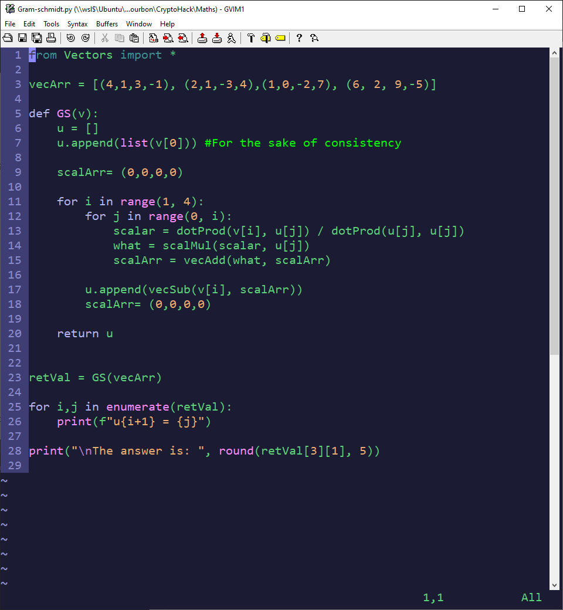

# Dotfiles
Any Linux/Windows config files

## Cascadia
This is the Windows Terminal with the inkpot colorscheme, modified and incomplete. Some colors don't match. Included Vim like keybindings for tmux like pane splitting and resizing. 

## Gvim
The Vim that I prefer to use in Windows. Colors and config are happily stolen from Gynvael Coldwind. Minus some stuff that I don't need.

